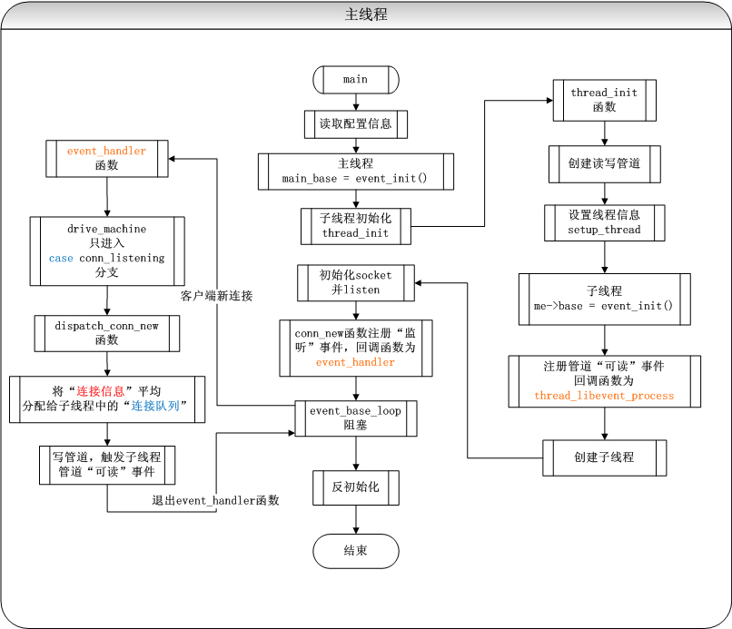
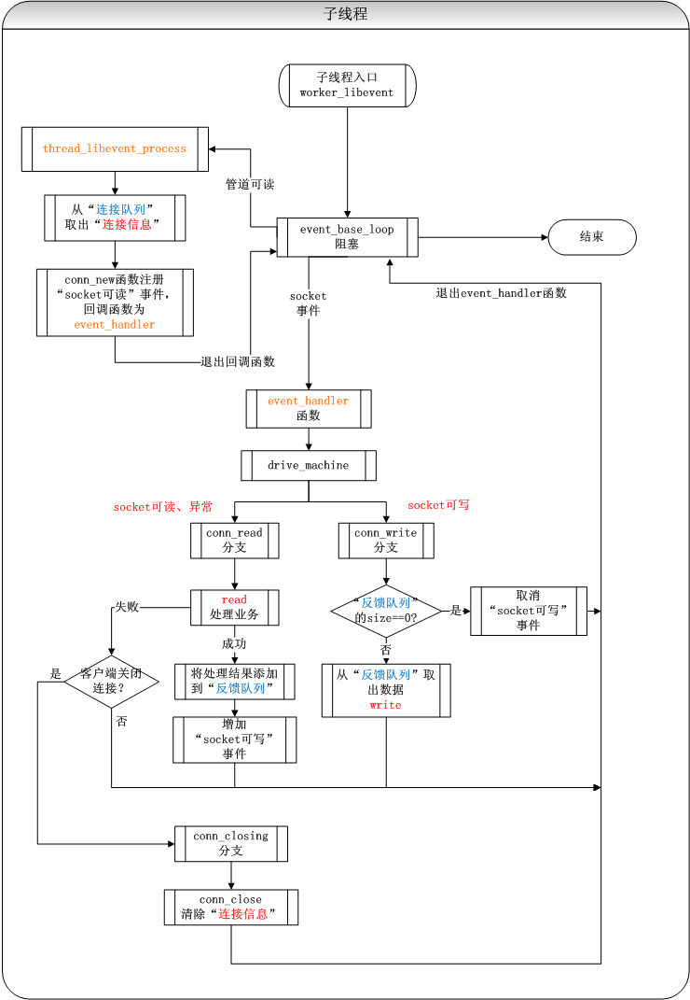

# 一种基于libevent的网络服务器模型

---

一、描述

   开发服务器可以使用很多的技术，例如使用Epoll实现，也可以使用libevent等网络库搭建网络模型。本文总结了在工作中使用libevent搭建网络模型的设计和开发过程。目标是达到较好的性能和并发性，本模型中采用了多线程技术，主线程和子线程之间通过管道进行通信。

二、模型描述

a)  综述

服务器有主线程和一组工作线程，其中主线程只负责监听客户端的链接请求，并将请求平均的分配给工作线程。工作线程负责处理与客户端的链接以及相关的业务。每个子线程维护一个连接队列，每一个连接有一个反馈的队列。

b) 主线程流程图  

c) 子线程流程图  

三、设计思路说明

a) 初始化和线程间通信

工作线程在初始化的过程中会注册管道的可读事件，主线程只注册对监听套接字的可读事件，主线程和工作线程之间通过管道进行通信，将通信套接字信息传递给工作线程。工作线程由主线程进行创建，为主线程的子线程。

b) 主线程的处理

主线程只处理监听套接字的可读事件，当accept成功返回后，将创建的通信套接字fd写入管道，工作线程的管道可读事件被激发，监听通信套接字的可读可写事件。主线程的业务逻辑极为简单，不处理实际的业务逻辑代码，增加了连接事件的响应速度。这里需要注意的是要平均的将通信套接字分配给工作线程。

c) 工作线程的处理

再来看下工作线程的处理过程，工作线程初始化完毕后只监听管道的可读事件，当主线程将通信fd写入管道，工作线程从管道中将通信fd取出并监听其可读事件。事件进入循环，如果通信fd上的可读事件到来，那么进入读操作，读操作有可能失败，这个时候要进行判断客户端是否已经退出链接，如果是则需要对fd调用close进行清除，否则就退出处理。如果读操作成功，则进入组包、处理请求的过程，并将反馈结果写入反馈队列并写入fd的可写事件，epoll的精髓就在于此，一定要写入可写事件。可写事件的处理相对较为简单，从反馈队列里取出反馈结果调用write写出。

四、测试及总结

关于libevent的性能网上的说法有很多，我自己在开发机上开启10个工作线程，测试客户端并发数1000，结果为 TPS：80000，CPU占用 150%

在本设计中当并发数很多时每个子线程需要处理的fd依然会非常庞大、这些fd的业务处理是在同一个线程中处理的需要竞争资源，而在多个工作线程之间其实并没有一个协调的过程，主要靠主线程的平均分配，这个地方有待改进。