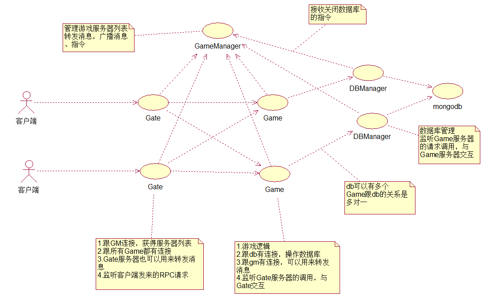

# 手游戏服务器集群

## 一 分类

游戏服务器按照功能分独立的进程，一般分类如下：  

* gm 中心服 
* db 数据库服
* game 游戏逻辑服
* gate 前端服

gm在一个集群中只有一个，其他可以有多个，同类服务器之间都没有连接。

gm跟所有的服相连，帮助其他服交换信息，控制其他服的关闭，跟所有的game连接，用于广播和game之间信息的转发。

db跟数据库相连，接受game的请求，负责数据的存取，方便game异步读写数据库。

game处理游戏逻辑，接受gate转发的客户端请求，处理完之后再通过gate返回信息给客户端，同时跟db相连，向db请求数据的存取。

gate直接跟客户端相连，负责消息的加密和解密，跟所有的game相连，转发客户的消息给game，也负责game之间消息的转发。

如图：

## 启动流程

1. 启动gm，监听其他服的连接；

2. 启动db，连接gm，将自己注册到gm中，连接好数据库，启动对game调用的监听；

3. 启动game，连接gm，将自己注册到gm中，连接指定的db，监听gate的连接；

4. 启动gate，连接gm，将自己注册到gm中保存，向gm请求所有的ganme服务器信息，然后连接所有的game，监听客户端的连接；

